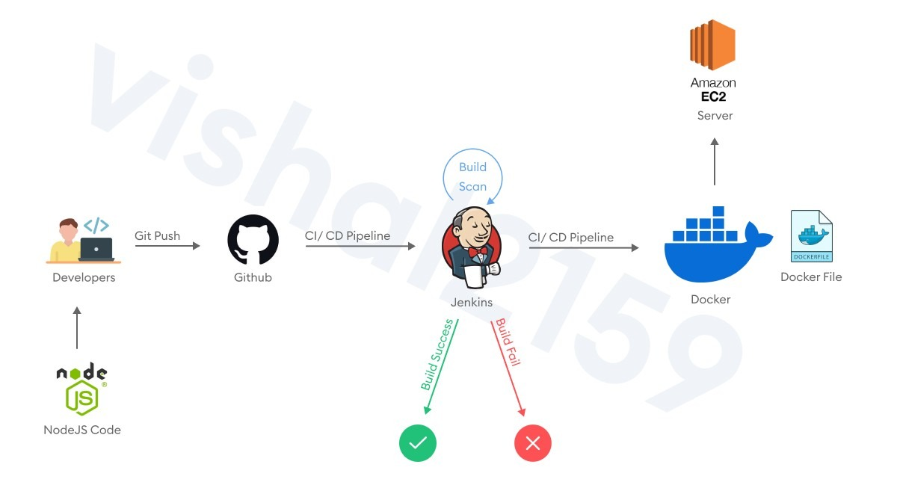

# 🚀 Jenkins CI/CD Pipeline with Docker & AWS EC2

An end-to-end **Continuous Integration and Continuous Deployment (CI/CD)** pipeline that automatically builds, containerizes, and deploys a **Node.js** application on an **AWS EC2** instance using **Jenkins** and **Docker**.

---

# 📖 Project Overview

This project demonstrates how a modern DevOps pipeline automates application deployment. Every code push to GitHub triggers Jenkins to fetch the latest source code, build a Docker image, deploy a fresh container, and make the updated application available on an AWS EC2 server.

The project eliminates manual deployment, ensuring faster, reliable, and repeatable software releases.

---

# 🏗️ System Architecture



The deployment workflow follows the architecture shown above:

```
Developer
    │
 Git Push
    ▼
GitHub Repository
    │
    ▼
Jenkins Server
    │
    ├── Clone Repository
    ├── Build Docker Image
    ├── Stop Existing Container
    ├── Remove Old Container
    └── Run New Container
            │
            ▼
Docker Container
            │
            ▼
AWS EC2 Instance
            │
            ▼
Live Node.js Application
```

---

# ⚡ CI/CD Workflow

1. Developer pushes source code to GitHub.
2. Jenkins clones the latest repository.
3. Docker builds a new application image.
4. Existing container is stopped and removed.
5. Jenkins launches the updated Docker container.
6. The latest application version becomes available on the AWS EC2 server.

---

# 🛠️ Tech Stack

* Node.js
* Express.js
* Docker
* Jenkins
* Git & GitHub
* AWS EC2
* Linux
* Bash Scripting

---

# 📂 Project Structure

```text
.
├── app.js
├── package.json
├── Dockerfile
├── README.md
└── Jenkins Build Script
```

---

# ✨ Features

* Automated CI/CD Pipeline
* GitHub Integration
* Dockerized Application
* Automated Build & Deployment
* Continuous Integration
* Continuous Deployment
* Cloud Deployment on AWS EC2
* Linux-based Automation

---

# 🔧 Jenkins Build Script

```bash
rm -rf *

git clone https://github.com/Sufyaan04/Jenkins-CI-CD-NodeJS.git .

docker stop myapp || true
docker rm myapp || true

docker build -t myapp .

docker run -d \
-p 3000:3000 \
--name myapp \
myapp
```

---

# 🐳 Docker Commands Used

### Build Image

```bash
docker build -t myapp .
```

### Run Container

```bash
docker run -d -p 3000:3000 --name myapp myapp
```

### Stop Container

```bash
docker stop myapp
```

### Remove Container

```bash
docker rm myapp
```

---

# 🌐 Application Output

After every successful build, Jenkins automatically deploys the latest version of the application.

```
http://<EC2-Public-IP>:3000
```

Example Response

```text
Hello from DevOps Pipeline App
```

---

# 📸 Project Demo

## Application Output


---

## Successful Jenkins Build


---

# 📊 Skills Demonstrated

* Continuous Integration (CI)
* Continuous Deployment (CD)
* Jenkins Automation
* Docker Containerization
* AWS EC2 Deployment
* GitHub Integration
* Linux Administration
* Bash Scripting
* Deployment Automation
* Debugging Production Deployments

---

# 🐞 Challenges Faced

While building this project, several real-world DevOps issues were encountered and resolved:

* Jenkins plugin installation failures
* GitHub authentication issues
* Docker permission denied errors
* Missing Dockerfile during builds
* Empty repository after cloning
* Incorrect Docker build context
* Jenkins workspace cleanup problems
* Existing container conflicts
* Port mapping issues
* Git synchronization conflicts

These problems were diagnosed using Jenkins Console Output, Docker logs, Git commands, and Linux troubleshooting techniques.

---

# 📚 Key Learnings

* Installing and configuring Jenkins on AWS EC2
* Setting up Docker for production deployment
* Integrating GitHub with Jenkins
* Automating software deployment
* Managing Docker containers
* Troubleshooting Jenkins pipelines
* Linux command-line debugging
* Building production-style CI/CD workflows

---

# 🚀 Future Improvements

* Jenkinsfile (Pipeline as Code)
* GitHub Webhooks
* Docker Hub Integration
* Automated Unit Testing
* SonarQube Integration
* Kubernetes Deployment
* Terraform Infrastructure as Code
* Monitoring using Prometheus & Grafana

---

# 🎯 Resume Highlights

* Designed and implemented an end-to-end CI/CD pipeline using Jenkins, Docker, GitHub, and AWS EC2.
* Automated application build, containerization, and deployment to eliminate manual release processes.
* Diagnosed and resolved real-world Jenkins, Docker, Git, and Linux deployment issues.
* Demonstrated cloud deployment using industry-standard DevOps practices and tools.

---

# 👨‍💻 Author

**Mohammad Sufyaan**

Computer Science Student • Full Stack Developer • DevOps Enthusiast

**GitHub**
https://github.com/Sufyaan04

**LinkedIn**
https://www.linkedin.com/in/mohammad-sufyaan-9637b7277/

---

## ⭐ If you found this project helpful, consider giving it a Star!
