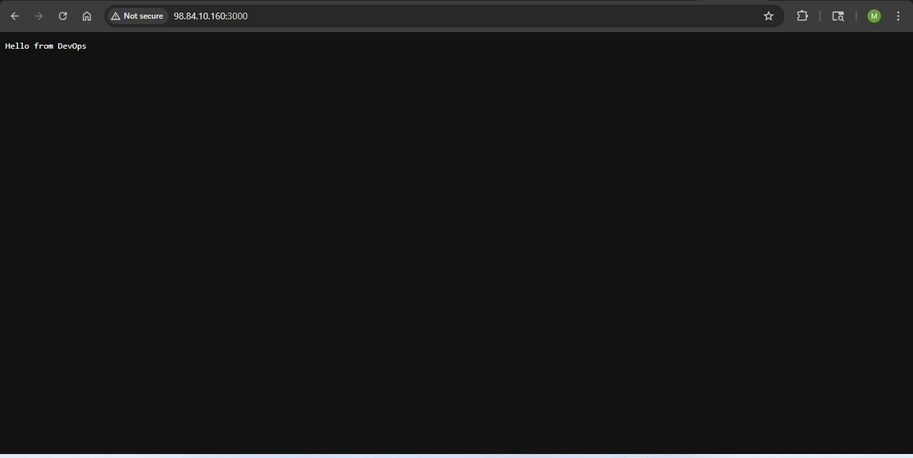
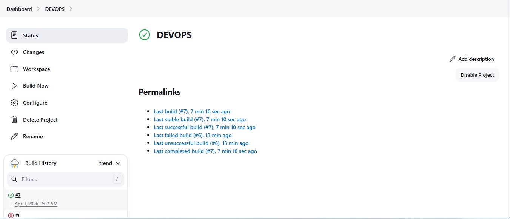

# 🚀 Jenkins CI/CD Pipeline with Docker & AWS EC2

An end-to-end Continuous Integration and Continuous Deployment (CI/CD) pipeline that automatically builds, containerizes, and deploys a Node.js application on an AWS EC2 instance using Jenkins and Docker.

---

# 📖 Project Overview

This project demonstrates how modern software is automatically built and deployed whenever new code is pushed to GitHub.

The pipeline integrates GitHub, Jenkins, Docker, and AWS EC2 to eliminate manual deployment, ensuring faster, reliable, and consistent releases.

---

# 🏗️ Architecture

```
Developer
    │
    │ Git Push
    ▼
 GitHub Repository
    │
    ▼
 Jenkins Server
    │
    ├── Clone Repository
    ├── Build Docker Image
    ├── Stop Previous Container
    ├── Remove Old Container
    └── Run New Container
           │
           ▼
 Docker Container
           │
           ▼
 AWS EC2 Instance
           │
           ▼
 Live Node.js Application
```

---

# 🛠️ Tech Stack

- Node.js
- Express.js
- Docker
- Jenkins
- Git & GitHub
- AWS EC2
- Bash
- Linux

---

# 📂 Project Structure

```
.
├── app.js
├── package.json
├── Dockerfile
├── README.md
└── (Optional) Jenkinsfile
```

---

# ⚙️ Features

- Automated CI/CD Pipeline
- GitHub Integration
- Automatic Docker Image Build
- Automatic Container Deployment
- Zero Manual Deployment
- Continuous Integration
- Continuous Delivery
- Cloud Deployment on AWS EC2

---

# 🚀 CI/CD Workflow

1. Developer pushes code to GitHub.
2. Jenkins detects new changes.
3. Jenkins clones the latest source code.
4. Docker builds a fresh image.
5. Previous container is stopped and removed.
6. A new container starts automatically.
7. Updated application becomes available on the EC2 server.

---

# 🐳 Docker Commands Used

Build Docker Image

```bash
docker build -t myapp .
```

Run Container

```bash
docker run -d -p 3000:3000 --name myapp myapp
```

Stop Container

```bash
docker stop myapp
```

Remove Container

```bash
docker rm myapp
```

---

# 🔧 Jenkins Build Script

```bash
rm -rf *

git clone https://github.com/Sufyaan04/Jenkins-CI-CD-NodeJS.git .

docker stop myapp || true
docker rm myapp || true

docker build -t myapp .

docker run -d \
-p 3000:3000 \
--name myapp \
myapp
```

---

# 🌐 Application Output

After every successful build, the application is automatically deployed and accessible at:

```
http://<EC2-Public-IP>:3000
```

Example Output

```
Hello from DevOps Pipeline App
```

---

# 📈 Skills Demonstrated

- Continuous Integration
- Continuous Deployment
- Jenkins Job Configuration
- Docker Containerization
- AWS EC2 Deployment
- Linux Administration
- GitHub Integration
- Shell Scripting
- Deployment Automation

---

# 🐞 Challenges Faced

During development, several real-world deployment issues were encountered and resolved:

- Jenkins Git Plugin installation issues
- GitHub authentication errors
- Docker permission denied
- Missing Dockerfile
- Empty repository after clone
- Incorrect build context
- Jenkins workspace cleanup
- Container name conflicts
- Port mapping issues
- Git repository synchronization

These issues were resolved through systematic debugging using Jenkins Console Output, Linux commands, Git, and Docker logs.

---

# 📚 Key Learnings

- Setting up Jenkins on AWS EC2
- Installing and configuring Docker
- Integrating GitHub with Jenkins
- Automating deployment pipelines
- Managing Docker containers
- Debugging Jenkins builds
- Linux command-line troubleshooting
- Building production-style deployment workflows

---

# 🔮 Future Improvements

- Jenkinsfile (Pipeline as Code)
- GitHub Webhooks
- Docker Hub Integration
- Automated Unit Testing
- SonarQube Code Quality
- Kubernetes Deployment
- Terraform Infrastructure Provisioning
- Monitoring with Prometheus & Grafana

---

# 🎯 Resume Highlights

- Designed and implemented an end-to-end CI/CD pipeline using Jenkins, Docker, GitHub, and AWS EC2.
- Automated application build, containerization, and deployment, reducing manual deployment effort.
- Diagnosed and resolved real-world Jenkins, Docker, and Git integration issues during deployment.
- Demonstrated cloud deployment and continuous delivery using industry-standard DevOps tools.

---

# 📸 Project Demo

## Application Output



## Jenkins Successful Build



# 👨‍💻 Author

**Mohammad Sufyaan**

Computer Science Student | Full Stack Developer | DevOps Enthusiast

- GitHub: https://github.com/Sufyaan04
- LinkedIn: https://www.linkedin.com/in/mohammad-sufyaan-9637b7277/

---

## ⭐ If you found this project helpful, consider giving it a star!
